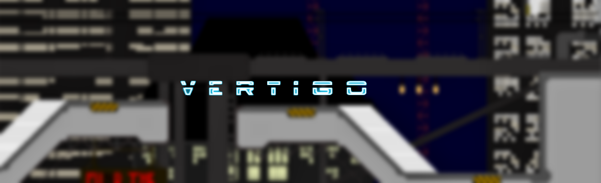
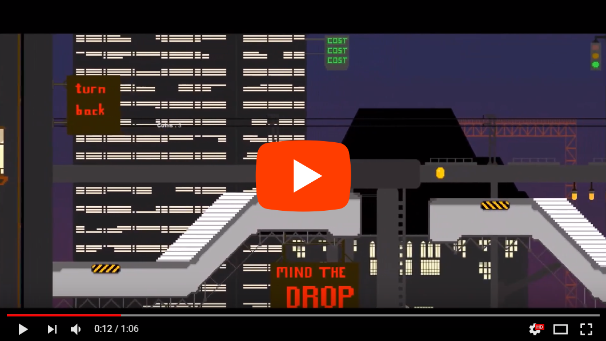

<h2>Vertigo - by Team #Hashtag</h2>
<h5>Kalyan Kola Cahill, &nbsp;&nbsp;&nbsp;&nbsp; Justine Quiapos, &nbsp;&nbsp;&nbsp;&nbsp; Hadi Nisamudeen

  

As a group, from the very beginning we knew we wanted to make a game. We had always aimed for a 2D platformer
which utilized a unique mechanic, taking advantage of it's medium as a 2D plane. While it went through many
changes through the design process, our original vision has remained intact and we couldn't be happier with the 
end result. This project was created using C# in Unity2D. Art assets were made in GIMP2, and Photoshop

The main features we wished to include were:

        * A mechanic allowing the player to rotate the map, changing the orientation of the platforms
        * A Parallax Background which turned the 2D plane into a 3D perspective
        * Custom animated, and dynamic sprites to bring life to the game
        * A map design which encouraged utilizing the rotate mechanic to its fullest
        * A fully animated player character
        * Custom background music
        

Video Demo:

Roles:

Kalyan Kola Cahill: Art Assets, Parallax Scripting, Music, and Object Animation

Hadi Nisamudeen: Character Animation, Sound Effects, and Coin Collection

Justine Quiapos: Scripting, Rotation Mechanic, and Room 2 Puzzles

